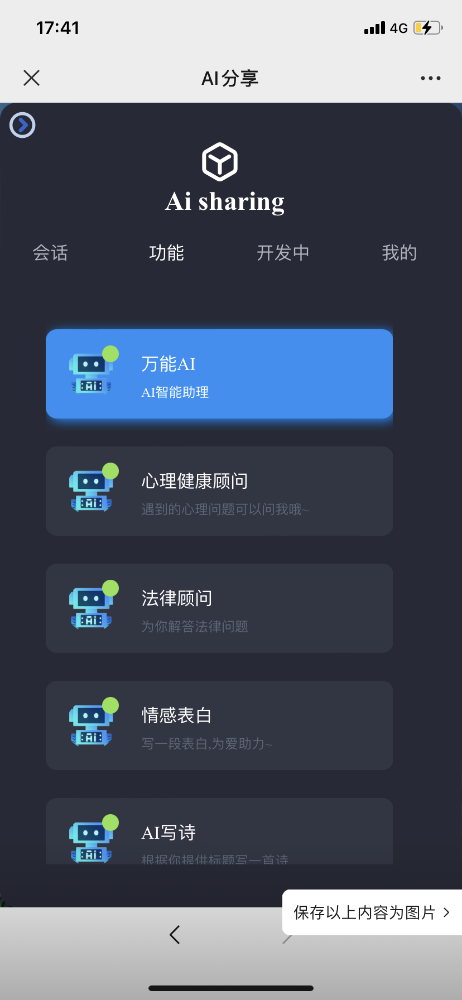
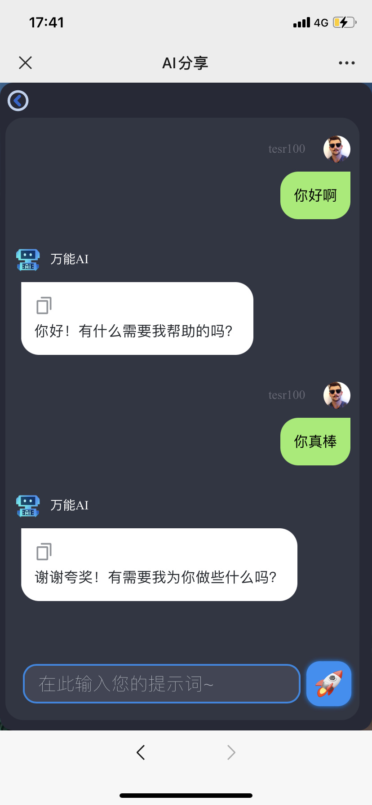
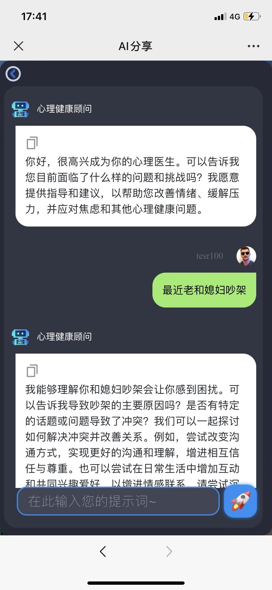
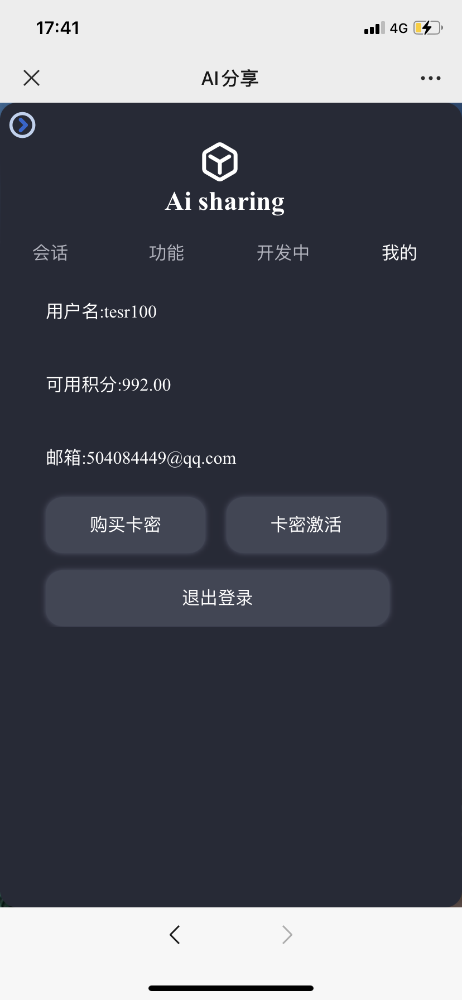

# Ai sharing Web
声明：此项目免费且作为开源学习使用。并且不会有任何形式的卖号、付费服务、卖key等行为。谨防受骗。
项目前后端分离，前端使用Vue2进行开发，后端使用thinkphp6，给大家提供一个好看的OpenAI web 管理界面，有好的建议和bug欢迎大家提出来，项目会一直开源和代码优化，方便大家交流学习开发。

> 🤭记得点个小星星

## 电脑端
.png)
## 电脑端会话
.jpg)
## 手机端




# 部署步骤
根据接口配置好后端地址
拉取前端代码到本地
## 本地部署
```
pnpm install
pnpm run serve
pnpm run build
// 或者 
npm install
npm run serve
npm run build

```

# 技术栈

|  名称   | 版本  |
|  ----  | ----  |
| vue  | 2.6.14 |
| element-ui  | 2.15.12 |
| NodeJS  | 14+ |
| tauri  | 1.2.3 |
| php  | 7.2  |
| thinkphp  | 6.0.8  |
| redis  | 6.2  |
| mysql  | 8.0  |

# 后台
| fastadmin  |   |

# 对接Chatgpt3.5官方接口

# 联系方式

兄弟们有问题可以加我v

# 免责声明
这不是官方的OpenAI产品。这是一个个人项目，与OpenAI没有任何关系。个人开发与其他并无关系,开源出来为大家学习使用交流。
